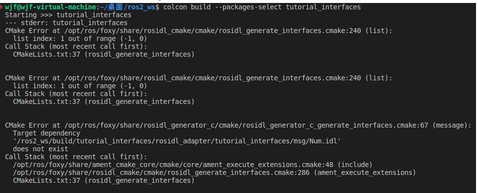

# RoboEnv

Welcome to **RoboEnv**, a repository designed to manage and set up the environment for robotic simulation and control. This repository includes an `environment.yaml` file that specifies all dependencies and links to other essential repositories, ensuring a seamless setup for robotic development and testing.

## Repository Overview

**RoboEnv** provides a central place to:
- Set up a consistent development environment for robotic simulation.
- Install and manage dependencies required for the `sim_and_control` and `mycobot_client` repositories.
- Facilitate easy integration and usage of robotic control algorithms.

## Getting Started

### Prerequisites

To get started with **RoboEnv**, you need to have the following software installed on your system:

- **Git**: Version control system to clone repositories.
- **Conda/Mamba**: Package manager for managing environments. Mamba is a fast, flexible, and user-friendly package manager. If you don't have Mamba installed, follow the installation instructions available [here](https://github.com/conda-forge/miniforge). once mamba is istalled move to the next section.

### Setting Up the Environment

1. **Clone the `roboenv` Repository:**

   ```bash
   git clone --recurse-submodules https://github.com/VModugno/RoboEnv.git
   cd RoboEnv
   ```

2.  **Install the Conda Environment and the simulation_and_control library:**

    The environment.yaml file includes all the dependencies required for the simulation and control projects. To create the environment, run the below commands.
    ```bash
    mamba env create -f environment_ros2.yaml
    mamba activate roboenv2 # or if it does not work try conda activate roboenv2
    cd simulation_and_control
    pip install .
    ```
   1. **Extra Installation Steps for windows user**
   after installing the enviroment roboenv2 the windows user have to perform some extra steps to get ros/ros2 compilation working properly. They have to install visual studio 2022 and ensure that during the installation process the c/c++ for desktop development package is selected. After this in the roboenv2 they need to install 2 more packages
   ```bash
   mamba install compilers
   mamba install mamba install vs2022_win-64
   ``` 
   after this they have to options: from the search bar the can open the developer prompt activate the mamba/conda env and work from there to run colcon build or they can open up the miniforge prompt and check if the visual studio dependecies is correctly referenced by typing 
   ```bash
   where cl.exe
   ```
   if this command return the path to visual code compiler then they are good to go also with
   the miniforge prompt
3.  **Using the Simulator**
    
   To ensure the simulator functions correctly, please copy the 'configs' and 'models' folders from the 'roboenv' environment into the same directory as your script. This directory is where your project's executable code is stored. The 'configs' folder contains essential configuration files that set the operational parameters for the simulator, while the 'models' folder includes the data models necessary for simulation. Placing these folders in the same directory as your script ensures that when the simulator runs, it can easily access and utilize these crucial resources, leading to a seamless operation

4.  **Connecting to the real elephant robot**  
    
    prior to use the mycobot client, there is a bug with ros2 and the new version of setuptools (see [here](https://github.com/colcon/colcon-python-setup-py/issues/41)). To build python ros2 packages, we need to replace some code in one of the python files in the mamba environment. There is a command to do this in Linux automatically below. You can run that. If you are on Windows or Mac, look below this command, it will not work for you.
    
    ```bash
    python -m site | grep -E miniforge3/envs.*?/lib/python3.11/site-packages | sed "s:,::g; s:\s::g; s:'::g" | awk '{print $1"/colcon_python_setup_py/package_identification/python_setup_py.py"}' | xargs sed -i -e "s/'from setuptools.extern.packaging.specifiers import SpecifierSet'/'from packaging.specifiers import SpecifierSet'/g"
    ```

    If you have trouble with the prior command, edit the file in a location similar to `/home/mz/miniforge3/envs/roboenv2/lib/python3.11/site-packages/colcon_python_setup_py/package_identification/python_setup_py.py` and change the line with `'from setuptools.extern.packaging.specifiers import SpecifierSet'` to `'from packaging.specifiers import SpecifierSet'`.

    On windows this may be in the directory `C:\Users\ACER\.conda\envs\roboenv2\Lib\site-packages\colcon_python_setup_py\package_identification`.

6. **Activate the Environment:**
    ```bash
    conda activate roboenv2
    ```

7. **Pull Submodule (if you already cloned the repository without the submodules):**
    ```bash
    git submodule update --init --recursive
    ```
8. Windows: Install Windows Build Tools--if on windows
```
# Install Visual Studio 2017, 2019 or 2022 with C++ support 
# see https://docs.microsoft.com/en-us/cpp/build/vscpp-step-0-installation?view=msvc-160

# Install the Visual Studio command prompt - if you use Visual Studio 2019:
mamba install vs2019_win-64

# Install the Visual Studio command prompt - if you use Visual Studio 2022:
mamba install vs2022_win-64
```

## Troubleshooting

### All Operating Systems
If you get an error like
```
CMake Error at /home/niels/opt/miniforge3/envs/roboenv2/share/cmake-3.29/Modules/FindPackage
...
Could NOT find Python3 (missing: Python3_NumPy_INCLUDE_DIRS NumPy)
...

```
Try building your code with this flag. There seems to be some trouble with mamba and virtual environments for some people.
```
colcon build --cmake-args -D Python3_FIND_VIRTUALENV=ONLY
```

Also note that if you get a weird error with CMAKE with indices, check that none of your paths have a chinese character in them. https://blog.csdn.net/weixin_45753396/article/details/129050343


### Windows:
Note that on windows you will need to `.\setup.bat` instead of source `install/setup.bash` when building. Also note you shouldn't use powershell, instead use command prompt or anaconda prompt.
WSL: use WSL 2
If doing native robostack, then you need to install visual studio 2019 or 2022 before you run the mamba install command.

### Mac:
Note that you will need to do the `.\setup.zsh` instead of `install/setup.bash` when building, or whatever your default shell is.
Note also that clion can cause issues with the cmake in the virtual environmnet. You may need to re-install clion.


